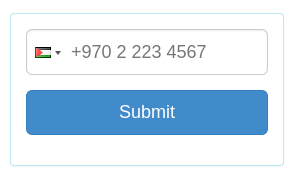
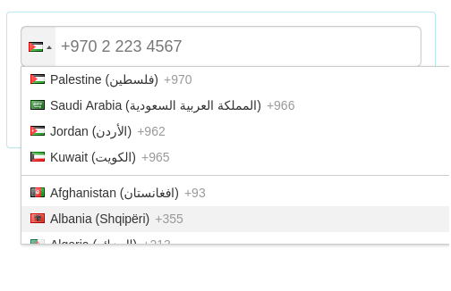
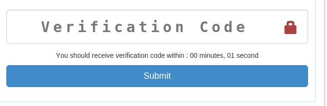

SMS VERIFICATION
================

A Yamsafer's angular module to verify mobile phone numbers with an sms, provides directives and services that talks to Yamsafer's SMS verification API.

Fast use
--------

* Include library  
`<script type="text/javascript" src="sms/dist/sms.min.js"></script>`.

* Dependencies: Must include dependencies for optimal use
	* [intl-tel-input](https://github.com/mareczek/international-phone-number) `<script src="bower_components/intl-tel-input/build/js/intlTelInput.min.js"></script>`.
	* [anglar-timer](https://github.com/siddii/angular-timer) `<scriptsrc="bower_components/angular-timer/dist/angular-timer.js"></script>`.


* Load Module  
`angular.module("YourApp", ["ysSmsVerification"])`.

* Use directive inside your html
	`<ys-sms-verification></ys-sms-verification>`

Slow use
--------

Yamsafer Sms Verification directive consists of two other child directives
1. Mobile Number Directive  
	*Responsible for  
		a. Input a valid international phone number.  
		b. Submit phone number for the `api` to send sms to that phone.  
		c. Inform the app that phone submission has happened and whether it succeeded or failed.  
	*Usage
			<mobile-number></mobile-number>
	*Template
			<form name="mobileNumberForm" ng-submit='submitNumber(phoneNumber)' >
				<div ng-if="fail" class="alert alert-danger text-center">
					Something went wrong, make sure you entered a valid phone number, or try a different one
				</div>
				<div class='form-group'>
					<input class='form-control input-lg'
						type="tel"
						preferred-countries="ps, sa,jo,kw"
						responsive-dropdown='true'
						default-country="ps"
						international-phone-number
						name="phoneNumber"
						ng-model="phoneNumber"
						ng-required="true" />
				</div>
				<div class='form-group'>
					<button type='submit'  class='btn btn-primary btn-block btn-lg'>Submit</button>
				</div>
			</form>

	*Renders  
		
		  


2. Code Verification Directive
	* Responsible for  
		a. Input a valid verification code.
		b. Submit verification code to api.  
		c. Inform app of the status (success, fail, etc).  
		d. Show a success/fail message, with options to try again.
	* Usage  
			<verification-code></verification-code>
	* Template  
	```
	<form name="verificationCodeForm" ng-submit='submitCode(code)' >
		<div class='form-group has-feedback'>
			<input
			class='form-control input-lg'
			type='text'
			name="code"
			ng-model='code'
			ng-minlength="5"
			ng-maxlength="7"
			ng-required='true'
			placeholder='Verification Code' />
			<span class="glyphicon glyphicon-lock form-control-feedback text-danger"/></span>
		</div>
		<p class="text-center">
			You should receive verification code within :
			<timer
			autostart="false"
			countdown="5"
			max-time-unit="'minute'"
			interval="1000"
			finish-callback="timerFinished()">
				{{mminutes}} minute{{minutesS}}, {{sseconds}} second{{secondsS}}
			</timer>
		</p>
		<p class="text-center" ng-show="timeout">
			Didn't receive code ? <a ng-click="tryAgain()" href="">Try a different number</a>
		</p>
		<div class='form-group'>
			<button type='submit' class='btn btn-primary btn-block btn-lg'>Submit</button>
		</div>
	</form>
	```
	* Renders  
		  
		When timer is over  
		  

Custmoization
-------------

To customize internal templates all you have to do is  

* To customize mobile number template
```
<script type="text/ng-template" id="mobile-number.html">
  Add html here
</script>
```

* To customize mobile verification code template
```
<script type="text/ng-template" id="verification-code.html">
Add html here
</script>
```
